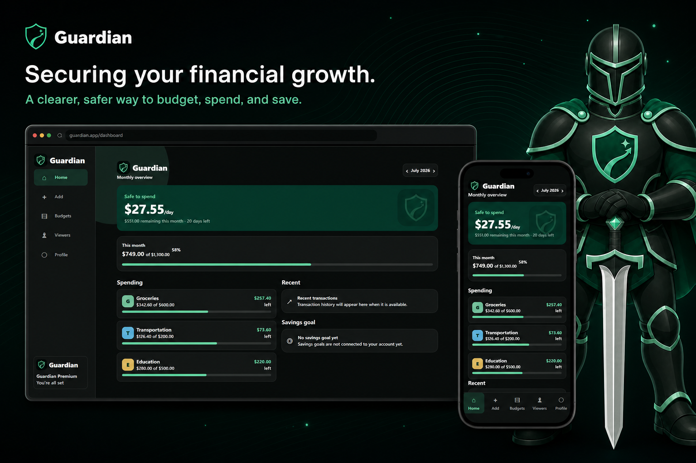
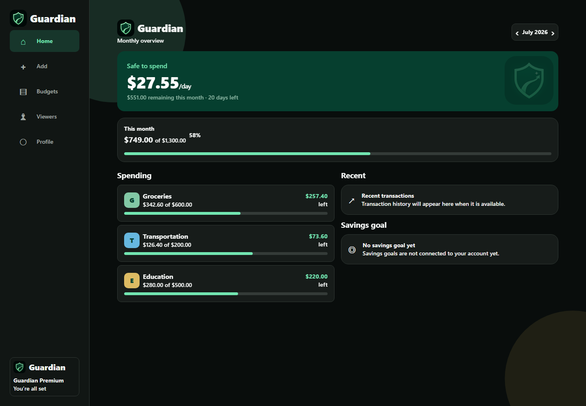
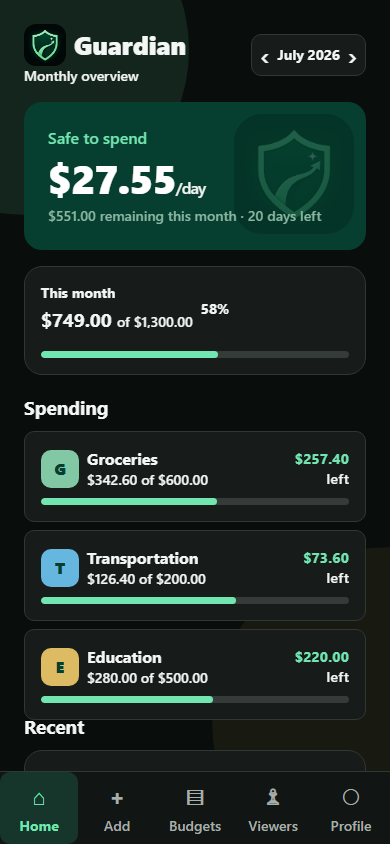

<p align="center">
  
</p>

<h1 align="center">Guardian</h1>

<p align="center"><strong>Securing your financial growth.</strong></p>

<p align="center">
  A responsive personal-finance prototype that turns monthly budgets and spending into a clear, protected view of what is safe to spend. Guardian combines an approachable fintech interface with a dependable warrior identity across mobile and web.
</p>

<p align="center">
  Guardian API Doc: https://guardian-api-5up5.onrender.com/docs/#/ 
</p>

<p align="center">
  <a href="#current-project-status"></a>
  <a href="https://expo.dev/"></a>
  <a href="https://reactnative.dev/"></a>
  <a href="https://www.typescriptlang.org/"></a>
  <a href="#platform-support"></a>
  <a href="./LICENSE"></a>
</p>

<p align="center">
  <a href="#about-guardian">About</a> ·
  <a href="#how-guardian-works">How it works</a> ·
  <a href="#key-features">Features</a> ·
  <a href="#technology-stack">Technology</a> ·
  <a href="#installation-and-local-development">Setup</a> ·
  <a href="#roadmap">Roadmap</a> ·
  <a href="#disclaimer">Disclaimer</a>
</p>

<p align="center">
  
</p>

## UI showcase

Guardian uses the same design system on phones and larger screens: an emerald-and-mint palette, compact category cards, clear budget progress, and responsive navigation. The image above combines live dark-mode captures from the Expo web application with the Guardian mascot for a portfolio-ready overview.

> The balances and transactions shown in project imagery are demonstration data created for presentation and testing. They do not represent a real financial account.

## About Guardian

<table>
  <tr>
    <td width="32%" align="center">
      
    </td>
    <td width="68%">
      <h3>A guardian for everyday financial decisions</h3>
      <p>Personal budgeting tools can bury the useful answer beneath charts and account terminology. Guardian is designed to surface a simpler question: after this month's spending and limits, what is safe to spend today?</p>
      <p>The product is intended for students and other budget-conscious users who want a focused monthly overview without the density of a full banking platform. Category limits, spending progress, and trusted read-only sharing make financial information easier to review and discuss.</p>
      <p>The warrior theme represents discipline, protection, and dependable guidance. Its closed helmet and centered sword create a confident silhouette without making the character aggressive, while the shield-and-growth-path emblem connects the mascot directly to Guardian's financial identity.</p>
    </td>
  </tr>
</table>

Guardian is currently a portfolio prototype—not a bank account, brokerage, or financial-advice service. It reads and writes budgeting data through a separately configured Guardian API; it does not connect to banks or calculate an authoritative account balance.

## How Guardian works

1. **Create or access an account.** Users can sign up or sign in with Firebase email/password authentication. Firebase restores persisted sessions on supported platforms, and the app intentionally uses a vague error message when authentication fails.
2. **Review the monthly dashboard.** Guardian requests category insights for the selected month and calculates total spent, total remaining, budget utilization, and a daily safe-to-spend figure from the remaining monthly amount and days left.
3. **Move between months and refresh.** Previous/next controls change the active month. Pull-to-refresh, loading, retry, empty, and over-budget states are implemented on the dashboard.
4. **Add a transaction.** The Add tab opens a modal sheet. After a merchant is entered, Guardian waits 800 ms before requesting a server-side category suggestion. The suggested chip is preselected; choosing another chip records a manual override.
5. **Set or replace budgets.** Users select one of ten categories, enter a monthly limit, and set or replace the existing value. Current limits and spending progress remain visible per category.
6. **Share a read-only view.** Users can invite a trusted viewer by email, share a selectable pending-invite code, accept an invite code, and revoke access with a two-step confirmation. Accepted shares open a clearly labeled read-only dashboard with no editing controls.
7. **Use the preferred layout and appearance.** Mobile uses five bottom tabs; larger web viewports use a sidebar. System, light, and dark appearance preferences persist locally, and subtle Reanimated background motion provides visual feedback without changing application behavior.

Recent transaction history, savings-goal management, notifications, password recovery, and most profile settings are not connected yet. They are documented in the [roadmap](#roadmap), not presented as finished features.

## Key features

| Capability | Status | Current behavior |
| --- | --- | --- |
| Firebase email/password authentication | **Available** | Sign-up, sign-in, sign-out, and session restoration |
| Monthly financial dashboard | **Available** | Safe-to-spend, totals, category progress, month switching, refresh, and over-budget treatment |
| Transaction entry | **Available** | Modal form with validation, date, note, category chips, success reset, and API persistence |
| Merchant categorization | **Available with API** | 800 ms debounced server suggestion with cache/LLM/fallback source labels and manual override |
| Category budgets | **Available** | Ten categories, monthly set/replace workflow, current-limit prefill, and progress display |
| Trusted viewers | **Available with API** | Invite, accept-by-code, status colors, selectable codes, two-step revoke, and read-only shared views |
| Responsive navigation | **Available** | Five-tab mobile navigation and desktop sidebar using the same screen components |
| Appearance preferences | **Available** | System, light, and dark modes persisted through AsyncStorage/browser storage |
| Motion and interaction feedback | **Available** | Ambient background motion, modal transitions, pressed states, and viewer-row animations |
| Recent transaction history | **In development** | API client support exists; the dashboard currently shows an honest placeholder |
| Savings goals | **Planned** | Dashboard placeholder only; no goal data flow is connected |
| Alerts and recommendations | **Planned** | No completed notification or financial-recommendation system |
| Profile settings and password recovery | **In development** | Appearance and sign-out work; the remaining settings rows and “Forgot Password?” text are presently visual only |
| Bank account synchronization | **Planned** | No bank credentials or aggregation provider is connected |
| Interactive mascot guidance | **Planned** | Mascot assets exist for branding, README, onboarding, and future empty states; there is no in-app assistant |

## Screenshots

<table>
  <tr>
    <td width="70%" align="center">
      
    </td>
    <td width="30%" align="center">
      
    </td>
  </tr>
  <tr>
    <td align="center"><sub><strong>Web:</strong> responsive two-column dashboard with persistent navigation.</sub></td>
    <td align="center"><sub><strong>Mobile:</strong> the same data hierarchy adapted to a compact viewport.</sub></td>
  </tr>
</table>

The uncropped images above are live captures from the Expo web build at desktop and mobile viewport sizes. Promotional device rendering is stored separately in [`docs/assets`](./docs/assets/).

## Technology stack

| Area | Technology in this repository |
| --- | --- |
| Frontend | React 19.1, React Native 0.81.5, Expo SDK 54 |
| Routing | Expo Router 6 with a single routed entry and component-managed application tabs |
| Web | React DOM 19.1 and React Native Web 0.21; static web output configured in `app.json` |
| Language | TypeScript 5.9 with `strict` mode enabled |
| Authentication | Firebase JavaScript SDK 12.16 using email/password authentication |
| Native persistence | `@react-native-async-storage/async-storage` for Firebase sessions and theme preference |
| Networking | Typed `fetch` helpers that attach a Firebase ID token to a separately hosted REST API |
| Validation and shared models | Zod 4 schemas for budgets, transactions, categorization, and trusted viewers |
| Styling | React Native `StyleSheet`, centralized light/dark design tokens, category colors, spacing, radii, and typography |
| Motion | React Native Reanimated 4, React Native Gesture Handler, and press/modal feedback |
| Backend | **Not included in this repository.** The client expects an API configured through `EXPO_PUBLIC_API_URL` |
| Database | **Not included in this repository.** Persistence and database configuration belong to the external API |
| Testing | No automated test runner is configured yet; strict type-checking, Expo lint, and manual web/native checks are the current validation path |
| Deployment | Static web export is configured; no EAS profiles, store release workflow, or hosting pipeline is included |

## Project architecture

```text
guardian-app/
├── assets/
│   └── images/
│       ├── guardian-app-icon.png   # Runtime brand mark
│       └── mascot/                 # Transparent mascot variants
├── docs/
│   └── assets/                     # README screenshots and promotional mockups
├── public/                         # Static web assets
├── src/
│   ├── app/                        # Expo Router layout and authentication gate
│   ├── components/                 # Dashboard, modal, budgets, viewers, profile, navigation
│   ├── constants/                  # Design tokens and category colors
│   ├── hooks/                      # Theme preference and color-scheme hooks
│   ├── lib/                        # Firebase initialization and authenticated API client
│   └── schemas/                    # Zod schemas and inferred TypeScript models
├── .env.example                    # Safe environment-variable template
├── app.json                        # Expo configuration
├── package.json                    # npm scripts and pinned application dependencies
└── tsconfig.json                   # Strict TypeScript and path aliases
```

The application deliberately keeps networking in [`src/lib/api.ts`](./src/lib/api.ts) and Firebase setup in [`src/lib/firebase.ts`](./src/lib/firebase.ts). Screens consume those typed seams while shared Zod schemas define the expected request and response shapes.

## Installation and local development

### Prerequisites

- Node.js supported by Expo SDK 54 (a current LTS release is recommended)
- npm (the repository includes `package-lock.json`)
- A Firebase project with email/password authentication enabled
- A compatible Guardian REST API base URL
- For device testing: Expo Go compatible with SDK 54, or a local iOS/Android simulator or emulator

### Set up the project

```bash
git clone https://github.com/Kenyang1/guardian-app.git
cd guardian-app
npm install
```

Create a local environment file from the safe template:

```bash
# macOS / Linux
cp .env.example .env

# Windows PowerShell
Copy-Item .env.example .env
```

Replace the placeholders in `.env` with your own Firebase client configuration and Guardian API URL. Never commit `.env`.

### Run the app

```bash
# Start Expo and choose a target interactively
npm start

# Open the web build
npm run web

# Open an Android emulator or connected device
npm run android

# Open the iOS simulator (requires macOS for the local simulator)
npm run ios
```

From `npm start`, scan the displayed QR code with a compatible Expo Go client to test on a physical device.

### Validate changes

```bash
# Strict TypeScript check
npx tsc --noEmit

# Expo lint
npm run lint

# Production-style static web export
npx expo export --platform web
```

There is currently no automated unit, integration, or end-to-end test script. Contributors should run the checks above and manually verify authentication, modal entry, month switching, budgets, viewers, theme modes, mobile layout, and desktop layout.

## Environment variables

All variables currently consumed by the client are listed in [`.env.example`](./.env.example).

| Variable | Purpose | Obtain it from |
| --- | --- | --- |
| `EXPO_PUBLIC_API_URL` | Base URL for the Guardian REST API | Your deployed backend/API environment |
| `EXPO_PUBLIC_FIREBASE_API_KEY` | Firebase web client identifier | Firebase Console → Project settings → Your apps |
| `EXPO_PUBLIC_FIREBASE_AUTH_DOMAIN` | Firebase Auth domain | Firebase web app configuration |
| `EXPO_PUBLIC_FIREBASE_PROJECT_ID` | Firebase project ID | Firebase project settings |
| `EXPO_PUBLIC_FIREBASE_STORAGE_BUCKET` | Firebase storage-bucket identifier | Firebase web app configuration |
| `EXPO_PUBLIC_FIREBASE_MESSAGING_SENDER_ID` | Firebase messaging sender ID | Firebase web app configuration |
| `EXPO_PUBLIC_FIREBASE_APP_ID` | Firebase web app ID | Firebase web app configuration |

> [!CAUTION]
> Expo embeds every `EXPO_PUBLIC_*` value in the client bundle. These values must never contain server credentials, Firebase Admin credentials, private keys, database passwords, paid-model API keys, or other secrets. Store privileged credentials only in the separately deployed backend.

## Platform support

| Platform | Target | Notes |
| --- | --- | --- |
| iOS | Expo / React Native | Portrait application target; verify with an SDK 54-compatible client or build |
| Android | Expo / React Native | Adaptive icon configuration is present; predictive back is currently disabled |
| Web | React Native Web | Responsive sidebar at desktop widths and mobile-style tabs below 900 px |

## Current project status

**Guardian is an educational portfolio prototype. It is not production-ready financial software.**

### What currently works

- Firebase email/password sign-up, sign-in, sign-out, and persisted session restoration
- Monthly budget insights, category progress, safe-to-spend math, over-budget display, refresh, retry, loading, and empty states
- Transaction creation with validation, server category suggestions, and manual category override
- Monthly category-budget set/replace workflow
- Trusted-viewer invitation, acceptance, status display, two-step revoke, and read-only shared dashboards
- Responsive mobile/web navigation, appearance preferences, and interaction motion

### Known limitations

- The required REST API and its database are not included in this repository.
- The configured server may have a cold start; the client calls `/health` on mount and explains the delay on the authentication screen.
- Recent transaction history is not wired into the dashboard even though an API helper exists.
- Savings goals, notifications, password recovery, help/privacy routes, and most profile settings are placeholders.
- Guardian does not import bank accounts, cards, balances, tax information, investments, or credit data.
- No formal accessibility audit, security audit, automated test suite, crash monitoring, analytics, or production deployment pipeline is included.
- Screenshots and promotional mockups use demonstration values and may not reflect a live production service.

## Disclaimer

> [!IMPORTANT]
> **Guardian is an educational and portfolio prototype.** It is not a bank, broker, lender, financial adviser, investment adviser, tax adviser, payment processor, or financial institution. Nothing displayed by the application should be treated as professional financial, investment, legal, or tax advice.
>
> Demonstration balances, transactions, analytics, category suggestions, and recommendations may use sample or test data. External APIs and services may be unavailable, incomplete, outdated, rate-limited, asleep, disabled, or changed because of cost, access restrictions, provider changes, or development status.
>
> Do not enter real bank credentials, card numbers, tax records, or other sensitive financial credentials unless you have independently reviewed and secured a production deployment. Users remain responsible for verifying their information and financial decisions. The project author is not responsible for financial loss or decisions made using this prototype.

## Privacy and security

The current client implements several useful security boundaries, but these are not a substitute for a production security program:

- Authentication is delegated to Firebase Auth; this repository does not implement its own password database.
- Native sessions use Firebase persistence backed by AsyncStorage, while web sessions use Firebase browser persistence.
- Authenticated API requests attach a Firebase ID token as a bearer token. The external API must still verify tokens and enforce authorization for every operation.
- Shared dashboards use a read-only client flow with no edit controls. Production security must also enforce that boundary on the server; UI restrictions alone are not authorization.
- `.env` files are ignored by Git, and `.env.example` contains placeholders only.
- Firebase client configuration identifies the public client and is bundled into the app. Server-side secrets must never use the `EXPO_PUBLIC_*` prefix or ship in this repository.
- Error messages intentionally avoid revealing whether a specific email account exists.

Guardian has **not** undergone a formal security, privacy, penetration, compliance, or accessibility audit. Before production use, the project would need reviewed API authorization and database rules, TLS-only endpoints, rate limiting, abuse controls, logging and monitoring, data-retention/deletion flows, secure secret storage, dependency review, incident response, and any legal or regulatory work required by its deployment context.

## Roadmap

### Completed in the current prototype

- [x] Firebase email/password authentication and session restoration
- [x] Responsive monthly dashboard with budget progress and safe-to-spend calculation
- [x] Transaction-entry modal with debounced category suggestion and manual override
- [x] Monthly category-budget set/replace workflow
- [x] Trusted viewers with invite codes, two-step revoke, and read-only shared views
- [x] Five-tab mobile navigation and desktop sidebar
- [x] System, light, and dark appearance modes
- [x] Guardian design tokens, app icon, mascot system, and promotional assets

### In development

- [ ] Connect recent transaction history to the dashboard and add edit/delete flows
- [ ] Implement savings-goal creation and progress tracking
- [ ] Connect password recovery, account/security, privacy, help, and notification settings
- [ ] Complete accessibility review and keyboard/screen-reader verification
- [ ] Add unit, integration, and end-to-end tests

### Planned

- [ ] Recurring-transaction detection
- [ ] Bank-account aggregation through a reviewed provider
- [ ] Explainable personalized insights and opt-in notifications
- [ ] Offline and network-recovery improvements
- [ ] Formal security and privacy review
- [ ] Production web hosting and monitored API deployment
- [ ] App Store, Google Play, and TestFlight release workflows

## Contributing

Contributions and constructive feedback are welcome while Guardian remains a prototype.

1. Fork the repository.
2. Create a focused branch from the default branch.
3. Make the smallest cohesive change and preserve the existing strict TypeScript architecture.
4. Do not commit `.env`, credentials, generated caches, or private user data.
5. Run `npx tsc --noEmit`, `npm run lint`, and the relevant manual mobile/web checks.
6. Open a pull request describing the change, validation performed, and any remaining limitation.

No separate contribution or code-style guide is currently published. Match the existing React Native `StyleSheet` patterns, reuse centralized theme tokens, and keep networking inside `src/lib/api.ts`.

## Author

**Kenyang Lual**

- GitHub: [@Kenyang1](https://github.com/Kenyang1)
- Repository: [Kenyang1/guardian-app](https://github.com/Kenyang1/guardian-app)

No portfolio or LinkedIn URL is stored in the current repository, so none is invented here.

## License

An MIT License file is present in the repository. See [`LICENSE`](./LICENSE) for the exact terms and existing attribution.

---

<p align="center">
  
</p>

<p align="center"><strong>Protect the plan. Understand the month. Grow with confidence.</strong></p>
